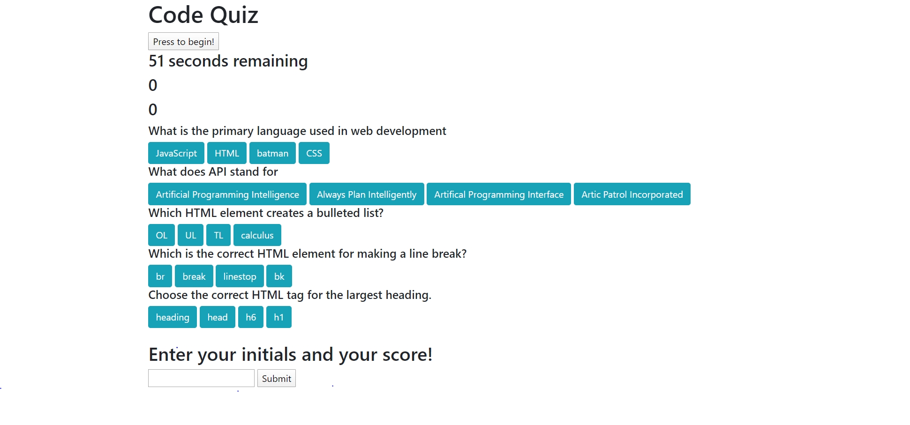

 Project Name
> password-generator

## Table of contents
* [General info](#general-info)
* [Screenshots](#screenshots)
* [Setup](#setup)
* [Status](#status)
* [Contact](#contact)

## General info
This is a program I designed  using vanilla javascript. The user takes a quiz consisting of 5 questions within a 60 second time frame. WHen the user finishes the game, they can publish their high scores and how they compare to others!

## Screenshots

## Setup
This program runs in browser. There is no installation needed.

## Code Examples
Show examples of usage:
// if correct button is clicked, move to next question
if (answer2.value === "HTML"){
answer2.addEventListener("click",function (){
    
    q1.textContent = "Correct!"
    answer1.parentNode.removeChild(answer1)
    answer2.parentNode.removeChild(answer2)
    answer3.parentNode.removeChild(answer3)
    answer4.parentNode.removeChild(answer4)
    userScore++
    score.textContent = "Your score is " + userScore

This is a block of javascript logic telling the program that if they click on the correct value, they'll be alerted they're correct. It then gives the user 1 point and shows them their score on the screen. While it does this, it deletes the previous 4 buttons. 

## Status
Project is in progress. Feel free to email me with any suggestions or to report any bugs: ianmharris93@gmail.com

## Contact
Created by Ian Harris(https://github.com/iannm93) - ianmharris93@gmail.com - feel free to contact me!
